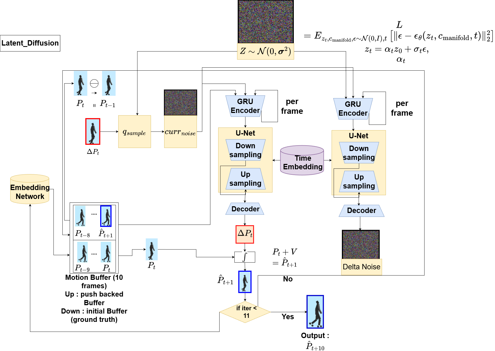
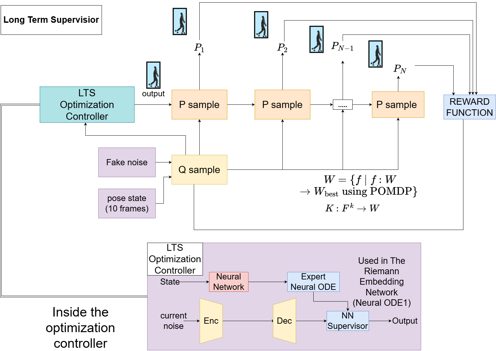

# MotionPrediction_Project
# MotionPrediction

MotionPrediction combines motion capture data processing, deep generative models, and a real-time renderer to predict and visualize human motion. The repository bundles the training code for several model variants alongside the Ogre-based viewer and Lua scripting environment used to drive experiments.

  

## Repository layout
- `Motion_Prediction/motion_prediction/work/`: Python training and evaluation scripts plus the `Makefile` entry points for experiments.
- `Motion_Prediction/motion_prediction/work/gym_mp/`: Lua environments used to configure rendering and data streaming to the Python side.
- `Motion_Prediction/motion_prediction/work/config/`: JSON configuration files for model hyperparameters and paths.
- `Motion_Prediction/motion_prediction/work/trained_models/`: Expected location for saved PyTorch checkpoints.
- `Motion_Prediction/motion_prediction/Resource`, `media13`, `lua`: Assets and Lua helpers required by the Ogre viewer.

## Model highlights
The primary model used in current experiments is a diffusion-based predictor that operates on 35-degree-of-freedom pose vectors. Training parameters such as sequence lengths, batch size, latent dimension (256), and the number of diffusion steps are defined in `work/config/dif_pose_vec.json`.

Key architectural pieces from `gym_mp/models2.py`:
- **Diffusion backbone**: `DenoiseDiffusion14` wraps a `GaussianDiffusion` process with `noise_steps` taken from configuration and couples it with a `UNet` denoiser specialized for 35-channel pose representations.【F:Motion_Prediction/motion_prediction/work/gym_mp/models2.py†L4684-L4701】
- **Temporal encoding**: Motion inputs and conditioning anchors are encoded through a GRU-based `Encoder`, while timestep embeddings (`TimeEmbedding`) provide diffusion-aware context for the denoiser.【F:Motion_Prediction/motion_prediction/work/gym_mp/models2.py†L4688-L4699】【F:Motion_Prediction/motion_prediction/work/train_motionprediction_dif16.py†L95-L119】
- **Pose reconstruction**: The decoder combines the encoded state and denoised sample to reconstruct the target pose vector, producing the model output along with diffusion mean/variance estimates for each timestep.【F:Motion_Prediction/motion_prediction/work/gym_mp/models2.py†L4703-L4764】

Default training hyperparameters (modifiable in `dif_pose_vec.json`) include a batch size of 2048, a three-phase curriculum (teacher, ramping, student epochs), a 10-step recursive prediction horizon, and 100,000,000 diffusion steps configured for experimentation.【F:Motion_Prediction/motion_prediction/work/config/dif_pose_vec.json†L10-L30】 The training script normalizes motion capture frames, instantiates `DenoiseDiffusion14`, and logs progress via TensorBoard.【F:Motion_Prediction/motion_prediction/work/train_motionprediction_dif16.py†L168-L199】

### Long-term supervisor pipeline
A long-horizon supervisor monitors sampled pose sequences alongside Q-samples to update the policy via a POMDP-style optimization controller. The controller mixes expert neural ODE feedback and Riemann embedding networks to steer the diffusion model toward reward-aligned pose generations.

  

## Running experiments
From `Motion_Prediction/motion_prediction/work/`, the `Makefile` exposes shortcuts for training and evaluation:
- `make train_mp_dif16` — train the diffusion model with the configuration in `config/dif_pose_vec.json` and Lua environment `gym_mp/dif_test_10.lua`.
- `make motionprediction_dif16` — run the trained diffusion model in inference/visualization mode.
- Additional targets exist for VAE/VQ-VAE baselines (e.g., `train_motionprediction_vae`, `train_mp_vqvae`).【F:Motion_Prediction/motion_prediction/work/Makefile†L1-L33】

Ensure Python dependencies (PyTorch, tensorboardX) are available and that the Ogre viewer assets remain in their default paths. Trained checkpoints are read from and written to `work/trained_models/` based on the `pt_name` configured in `config/dif_pose_vec.json`.
